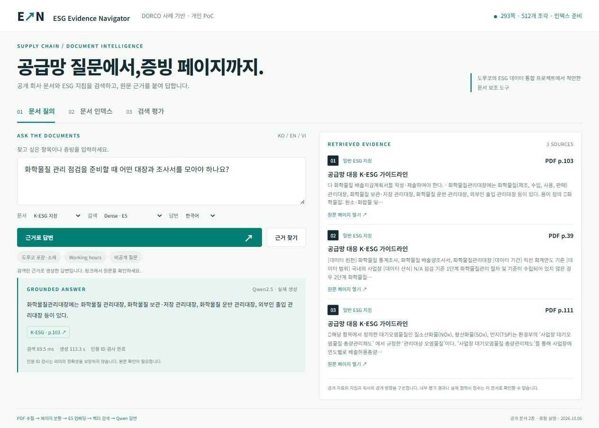

# ESG Evidence Navigator

**공급망 질문에서, 증빙 페이지까지.** 공개 PDF를 페이지 단위로 추출하고 다국어 임베딩으로 검색한 뒤, 검색된 근거로 로컬 Qwen이 답하는 RAG 개인 PoC입니다.



## 왜 이 과제인가

이수그룹은 2025년 9월 15일 도루코의 국내외 사업장·협력사 공급망 700여 곳의 ESG 데이터를 통합하는 플랫폼을 개발 중이라고 발표했습니다. 영어·베트남어, 웹 보고서 작성, 모니터링, 에너지 사용량 기반 배출량 계산을 설명합니다. [공식 발표](https://www.isu.co.kr/kor/prcenter/news_view.jsp?sno=864)

이 사례에서 **담당자가 진단 항목과 필요한 증빙을 문서에서 찾는 일**을 개인 프로젝트 과제로 선정했습니다. 기존 플랫폼을 복제하거나 회사 내부 시스템에 연결한 작업이 아닙니다. 공개 발표에는 RAG 적용이나 현재 운영 완료가 확인되지 않으므로, 이 저장소는 **공개 사례에서 착안한 별도 문서 보조 도구**입니다. 도루코의 [AI 업무혁신 공고](https://dorco.recruiter.co.kr/career/jobs/129929)가 요구하는 RAG·Agent 도입 검증과 업무 PoC를 설명할 수 있는 산출물을 목표로 했습니다.

## 실제 구현

```text
공식 PDF 2종 (293쪽)
  → PyMuPDF 페이지 추출 / 원문 ID·쪽 번호 보존
  → PDF 특수 공백 정규화 / 900자 분할 / 180자 중첩
  → 512개 조각 / multilingual-E5-small / passage: / 정규화 384차원
  → 질문 query: / cosine Dense 검색
  → BM25 비교 / RRF Hybrid / 페이지 중복 제거
  → 상위 3개 조각을 로컬 Qwen2.5-1.5B에 전달
  → 실제 생성 종료·인용 ID·형식 검사
  → 답변 / PDF 페이지 링크 / 보류·실패 상태
```

- **실제 신경망 임베딩**: 문자열 포함 검색을 벡터 검색으로 표현하지 않습니다. 512×384 float32 벡터를 로컬에서 계산했습니다.
- **검색과 생성 분리**: 검색만 실행하거나, 실제 모델 답변을 요청할 수 있습니다. UI에 검색 시간과 생성 시간이 표시됩니다.
- **문서 범위 선택**: 전체/회사소개서/K-ESG 지침을 사용자가 지정해 회사 공개 방향과 일반 기준의 혼동을 줄입니다. 위 검색 평가 수치는 필터 없이 전체 코퍼스로 측정했습니다.
- **근거 추적**: `doc_id`, `chunk_id`, PDF 물리 페이지, 원문 URL을 보존합니다. 회사의 공개 방향과 일반 K-ESG 지침을 구분합니다.
- **실패 표시**: 잘못된 인용 ID·형식·토큰 한도 종료는 `failed`로 반환합니다. 답변을 미리 작성해 성공 화면으로 교체하지 않습니다.
- **명시적 범위 가드**: 비공개 점수·계약이나 지시 무시 패턴에 `abstained`를 반환합니다. 이 가드는 학습된 관련성 판정이나 포괄적인 환각 방지가 아닙니다.

### 공개 문서

| 문서 | 페이지 | 조각 | 역할 |
|---|---:|---:|---|
| [DORCO Company Catalog](https://www.dorcofrance.com/resource/pdf/dorco-company-catalog.pdf) | 34 | 37 | 회사가 공개한 포장·소재·ESG 방향 |
| [공급망 대응 K-ESG 가이드라인](https://k-esg.org/post/43) | 259 | 475 | 진단 항목, 데이터 원천·기간·범위 |

문서 다운로드 URL·SHA256·분할 설정은 [sources-manifest.json](sources-manifest.json), 모델 revision·라이선스는 [model-manifest.json](model-manifest.json)에 있습니다. K-ESG의 과거 문서 내용을 현재 법률 자문으로 사용하지 않습니다. 공개 다운로드를 재배포 허가로 간주하지 않아 **원문 PDF·추출 본문·벡터·모델 가중치는 GitHub에 포함하지 않습니다.** 화면에는 설명에 필요한 짧은 발췌와 원문 링크만 제공합니다.

## 검색 평가 — 결합이 항상 낫지는 않았습니다

PDF 페이지를 수동 대조해 질문·정답 페이지를 먼저 지정했습니다. Dev 6문항과 Test의 답변 가능 24문항(KO 12 / EN 8 / VI 4)을 나눴습니다. 질문 3개의 패턴 가드는 검색 지표에서 제외했습니다. 이 **자체 제작 소규모 세트**를 평가했으며, 독립 협력사 벤치마크나 LLM 답변 정확도 평가가 아닙니다. 검색 파라미터와 질문은 변경하지 않았습니다. **최초 평가 뒤 원문을 다시 대조하여, 동일 내용을 다루는 기초·심화 페이지를 정답으로 추가한 v2 라벨**로 재집계했습니다. 최초 결과와 정답도 보존했습니다. 미접촉 holdout 성능이라고 표현하지 않습니다.

| 방식 | Page Hit@1 | Page Hit@5 | MRR@5 |
|---|---:|---:|---:|
| BM25 | 9/24 · 37.5% | 10/24 · 41.7% | 0.396 |
| Dense E5 | 11/24 · 45.8% | 14/24 · 58.3% | 0.498 |
| Hybrid RRF | 10/24 · 41.7% | 11/24 · 45.8% | 0.427 |

Page Hit@k는 상위 k개 조각에 정답 문서·페이지가 포함된 질문 비율입니다. MRR@5는 상위 5개 내 최초 정답 조각의 역순위 평균이며, 상위 5개에 없으면 0입니다. 중복 페이지는 제거하고 같은 인덱스·질문·k로 비교했습니다.

v2에서 Dense의 영어 Page Hit@5는 2/8, 베트남어는 2/4, 한국어는 10/12였습니다. RRF의 우월성은 확인하지 못했습니다. 다음 검증은 신규 질문 세트를 따로 작성한 뒤 반복 헤더 제거·토큰 기준 분할·검색 실패 원인을 확인하는 순서입니다. 이 수치를 실제 업무 시간 절감률이나 일반 검색 정확도로 확대하지 않습니다.

라벨 보완 전 Page Hit@5는 BM25 10/24, Dense 14/24, Hybrid 11/24였습니다. 개선된 수치는 검색 모델을 바꾼 결과가 아니라, 기존에 누락된 동등한 정답 페이지를 인정한 결과입니다. [사후 라벨 대조 내역](docs/label-audit.json), [최초 결과](docs/evaluation-results-initial.json), [최초 정답](data/evaluation-v1.json)을 함께 제공합니다.

- [질문 및 페이지 정답](data/evaluation.json)
- [전체 결과·언어별 분모·실패 질문·검색 순위](docs/evaluation-results.json)
- [문서 인덱스 화면](docs/screenshots/02-document-index.jpg)
- [검색 평가 화면](docs/screenshots/03-retrieval-evaluation.jpg)

## 실제 모델 생성 시연

한국어(67.98초)·영어(33.22초) 사례는 생성 종료와 인용 ID 검사를 통과했고 원문과 수동 대조했습니다. 한국어 답변은 관리대장 유형을 안내했지만 질문의 조사서 부분은 빠졌습니다. 베트남어 사례(52.90초)는 모델이 중국어를 출력해 `failed`로 반환했습니다. 베트남어 답변 품질을 성공으로 주장하지 않습니다. 초기 형식 실패 뒤 출력 규약과 파서를 보완한 과정도 기록했습니다. [짧은 답변·상태·인용·수동 검토](docs/generation-smoke-results.json)

## 실행

Python 3.13.7 / CPU PyTorch 2.6.0에서 확인했습니다. 인터넷은 모델과 공식 PDF의 최초 다운로드에 필요하며, 인덱스와 생성은 로컬에서 실행합니다. 두 모델 다운로드는 합계 약 3.6GB입니다.

```powershell
python -m venv .venv
.venv\Scripts\Activate.ps1
python -m pip install -r requirements.txt
python -X utf8 scripts/download_models.py
python -X utf8 scripts/ingest.py
python -X utf8 scripts/evaluate.py
python -X utf8 model_server.py
# 다른 터미널
python -X utf8 server.py
```

브라우저에서 `http://127.0.0.1:8770`을 엽니다. 검색만 사용할 때는 Qwen 서버가 없어도 됩니다. 모델 서버는 `127.0.0.1:8892`입니다. 모델 파일은 저장소의 형제 디렉터리 `../model-cache/`에 다운로드합니다. 서비스는 개발용 루프백 실행이며 인증·멀티테넌트·사내 운영을 구현한 것으로 표현하지 않습니다.

```powershell
python -X utf8 -m unittest discover -s tests -v
python -X utf8 scripts/http_checks.py
```

첫 명령은 분할·공백 정규화, BM25/RRF, 인용 ID, 명시적 가드, 경로 경계를 검사합니다. 두 번째는 실행 중인 API의 Host/Origin·경로·본문 크기·입력 범위를 검사합니다. 실제 PDF 추출·임베딩·검색 평가는 CI 단위 테스트와 별도로 로컬에서 실행한 결과입니다.

## 한계와 제작 범위

- 900자 분할은 토큰 기준이 아닙니다. 512개 중 6개 조각은 임베딩의 512-token 한도를 초과(최대 530)해 임베딩에서 잘렸습니다. 검색 본문은 보존했습니다.
- Qwen에는 상위 3개 조각의 **각 앞부분 700자**만 전달합니다. 뒤쪽에 필요한 근거가 있으면 답변에 빠질 수 있습니다.
- 인용 ID 검사로 검색된 조각을 가리키는지만 확인합니다. 답변의 의미가 원문에서 완전히 뒷받침되는지는 자동 검증하지 않습니다.
- 사내 데이터·협력사 실사·운영 성과·현업 사용성 테스트는 포함하지 않습니다. 영어·베트남어 번역 품질을 전문가가 평가하지 않았습니다.
- 김현태의 채용 포트폴리오용 개인 PoC이며 **Codex의 조사·코드 작성·검토 지원으로 제작**했습니다. 사용자 요구와 과제 선정, 구현·측정 산출물을 보여주며 모든 코드를 수작업 단독 작성한 경력으로 주장하지 않습니다.

코드는 MIT 라이선스입니다. 외부 문서·모델에는 각 제공자의 권리와 조건이 적용됩니다. 도루코·이수시스템과의 협업이나 공식 제품을 뜻하지 않습니다.

## 사용한 오픈소스 구성


위쪽은 PyMuPDF → multilingual-E5-small → NumPy → Qwen2.5의 의미 검색 RAG 경로입니다. 아래쪽은 Python·PyTorch·Hugging Face 라이브러리의 공통 실행 기반입니다. [도구별 역할과 로고 출처](docs/architecture/README.md)를 확인할 수 있습니다.
