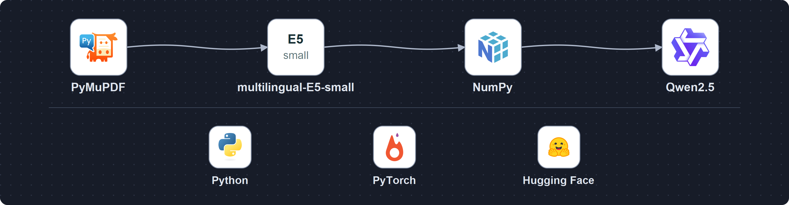

# 도루코 RAG 프로젝트에서 사용한 오픈소스

2026-10-06 · 공개 문서 기반 개인 PoC. 도루코 내부 시스템과 연동하거나 회사에 배포한 프로젝트가 아닙니다.

위쪽 화살표는 실제 구현의 의미 검색(Dense) 경로를 나타냅니다. PyMuPDF로 PDF 페이지를 읽고, multilingual-E5-small로 문서와 질문을 숫자로 변환합니다. NumPy가 비슷한 문서 조각을 찾아 상위 3개를 전달하면, Qwen2.5-1.5B-Instruct가 답변과 인용 번호를 생성합니다. 문서 변환은 미리 수행하며 질문은 검색할 때 변환합니다.

아래쪽 로고는 공통 실행 기반과 모델 연결 도구입니다. 아래쪽의 나란한 배치는 처리 순서나 별도 API 연결을 뜻하지 않습니다.

| 구분 | 사용한 오픈소스 | 역할 | 확인한 코드 |
|---|---|---|---|
| 문서 읽기 | PyMuPDF 1.28.0 | PDF 페이지별 본문 추출, 원문 페이지 렌더링 | scripts/ingest.py, server.py |
| 의미 변환 | SentenceTransformers 3.4.1 + multilingual-E5-small | 문서·질문을 정규화 384차원 벡터로 변환 | scripts/ingest.py, ragdesk/retrieval.py |
| 검색 계산 | NumPy 2.2.3 | 벡터 저장·읽기, 코사인 유사도 계산 | ragdesk/retrieval.py |
| 답변 생성 | Transformers 4.49.0 + Qwen2.5-1.5B-Instruct | 상위 3개 조각의 각 앞부분 700자를 받아 로컬 답변 생성 | model_server.py, ragdesk/answering.py |
| 모델 실행 | PyTorch 2.6.0 | CPU에서 임베딩과 생성 모델 실행 | scripts/ingest.py, model_server.py |
| 모델 파일 | huggingface-hub 0.29.1 | 모델 파일 취득·캐시 기반 의존성 | requirements.txt, model-manifest.json |
| 구현 언어 | Python 3.13 | 수집·검색·생성 연결, HTTP 서버와 평가 스크립트 | requirements.txt 및 Python 소스 |

BM25와 Hybrid(RRF) 검색도 Python 코드로 구현했습니다. 구성도는 Dense 대표 경로이며, 세 방식의 비교는 포트폴리오 3장과 저장소의 평가 결과에서 확인할 수 있습니다. 별도 벡터 DB나 Ollama를 사용하는 구조로 표시하지 않았습니다.

E5는 확인된 공식 심볼이 없어 이름 카드를 사용했습니다. Qwen은 공식 Qwen 팀 블로그의 제품군 심볼을 실제 모델 이름 Qwen2.5와 함께 표시했습니다. Hugging Face 로고는 라이브러리 생태계를 나타내며 E5 모델의 제작자 표시가 아닙니다. PyMuPDF의 Py 글자는 공식 심볼 자체에 포함된 부분을 그대로 보존했습니다.

모델 정보와 리비전: [E5](https://huggingface.co/intfloat/multilingual-e5-small) · [Qwen2.5-1.5B](https://huggingface.co/Qwen/Qwen2.5-1.5B-Instruct). E5 모델은 MIT, 해당 Qwen 모델은 Apache-2.0으로 모델 원장에 기록되어 있습니다. 로고 사용 조건과 모델·코드 라이선스는 별개이며 로고는 협업·후원·인증을 뜻하지 않습니다.

로고별 공식 URL, 고정 리비전, SHA-256과 사용 범위는 로고 출처 JSON에 기록했습니다. PDF는 3장, 16:9이며 수정본을 저장한 뒤 다시 열고 전체 페이지를 렌더링해 확인했습니다.
