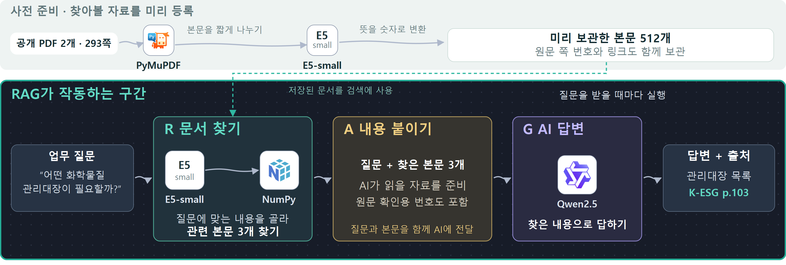

# 쉬운 설명과 구현 상세

## 그림은 이렇게 읽습니다

회색 위쪽은 질문하기 전에 자료를 준비하는 과정입니다. PDF 본문을 짧게 나눠 검색할 수 있도록 보관하고, 원문의 쪽 번호와 링크도 함께 남깁니다.

청록색 경계 안은 질문을 받을 때 작동하는 RAG입니다. **문서 찾기 → 찾은 내용 붙이기 → AI 답변**으로 읽으면 됩니다. 기술 이름을 몰라도 관련 문서를 먼저 찾고, 찾은 내용을 질문과 함께 AI에게 보내 답하게 하는 연결을 이해할 수 있도록 설명했습니다.

- R: 질문과 뜻이 비슷한 본문 3개를 찾습니다.
- A: 원래 질문에 찾은 본문과 원문을 확인할 번호를 붙여 AI 입력을 만듭니다.
- G: Qwen이 이 내용을 읽고 답변합니다. 이후 애플리케이션이 인용 번호를 원문 쪽 번호와 링크로 연결합니다.

## 기술 담당자를 위한 정확한 구성

| 도구·모델 | 버전·모델 | 실제 역할 |
|---|---|---|
| Python | 3.13 | 문서 수집·검색·생성 연결, 서버·평가 스크립트 |
| PyMuPDF | 1.28.0 | PDF 페이지별 본문 추출과 원문 렌더링 |
| SentenceTransformers | 3.4.1 | multilingual-E5-small을 이용한 문서·질문 변환 |
| multilingual-E5-small | 모델 원장에 리비전 고정 | 정규화 384차원 의미 벡터, query: / passage: 접두어 |
| NumPy | 2.2.3 | 벡터 저장·읽기, 코사인 유사도 계산 |
| PyTorch | 2.6.0 | CPU에서 모델 실행 |
| Transformers | 4.49.0 | Qwen2.5-1.5B-Instruct 생성 실행 |
| huggingface-hub | 0.29.1 | 모델 파일·캐시 관련 의존성 |

포트폴리오의 대표 모식도는 Dense 검색 경로입니다. BM25(단어 검색), Dense(의미 검색), Hybrid(RRF로 두 결과 결합)는 실제 코드에서 별도로 비교했습니다.

A 단계에서는 질문에 검색된 본문 상위 3개의 **각 앞 700자와 chunk_id**를 넣습니다. 그림의 '원문 확인용 번호'는 이 조각 ID를 쉬운 말로 설명한 것입니다. 모델에 원문 URL 전체를 전달하는 구조로 표시한 것은 아닙니다. 생성 후 애플리케이션이 반환된 ID를 문서 제목·쪽 번호·URL에 연결합니다. 인용 번호 검사만으로 답변의 의미가 정확하다고 보장할 수는 없습니다.

전체 자료는 공개 PDF 2개, 293쪽, 512개 본문 조각입니다. 모델을 재학습하는 작업이나 도루코 내부 시스템과의 연결·배포는 수행하지 않았습니다. 코드 근거는 scripts/ingest.py, ragdesk/retrieval.py, ragdesk/answering.py, model_server.py, requirements.txt와 model-manifest.json입니다.

## 평가 수치의 의미

24개 자체 질문에서 검색 결과 5개 안에 정답 쪽이 포함된 질문 수를 셌습니다. BM25 10/24, Dense 14/24, Hybrid 11/24입니다. Dense 외국어 결과는 영어 2/8, 베트남어 2/4입니다. 이 수치는 검색 성능이며 AI 답변의 정확도나 업무 시간 절감률이 아닙니다. 최초 결과를 확인한 뒤 원문에서 중복 정답 쪽 번호를 찾아 보완한 v2이며 독립 검증 세트가 아닙니다.

한국어·영어·베트남어 생성 각 1건을 별도로 확인했습니다. 한국어 답변은 관리대장 목록이 원문과 맞지만 조사서 부분에 답하지 않았고, 영어 답변은 원문 내용과 대조했지만 질문보다 넓게 답했습니다. 베트남어 요청은 중국어 출력으로 실패했습니다. 개선 과제와 실적은 구분합니다.

## 가독성 점검

384차원, 조각 ID, 700자 입력 제한, Dense·Hybrid 등의 상세 용어는 이 설명으로 옮겼습니다. R/A/G는 검색한 자료가 답변에 쓰이는 연결을 보여주기 위해 한국어 단계명과 함께 유지했습니다. 기술·모델 이름, 질문 인용, 화면 원본, 평가 수치와 한계는 보존했습니다. 화면 전체 100%와 75%(1200×675)에서 제목·흐름·결과를 확인했고, PDF 재열기·페이지 수·링크·텍스트 경계도 검수했습니다. 실제 화면의 작은 세부 지표는 참고 자료이며, 핵심 설명은 큰 흐름도와 비교 숫자로 읽도록 구성했습니다. 실제 채용 담당자를 대상으로 한 사용자 테스트를 했다고 주장하지 않습니다.
